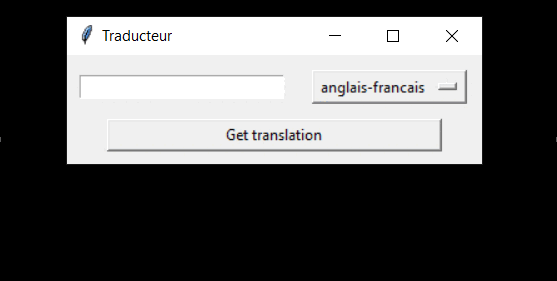

# Translate And Save


> A Python application to get translations for a given word and translating
> languages

`Disclaimer :` 
- Web Scraping may be against the <ins>terms of use</ins> of some websites a
  nd users may be subject to legal ramifications depending on where and how 
  they attempt to scrape information.
- So, Always inspect the Robots.txt as many websites specifies what is 
  considered as good behaviour on that site, such as areas that are allowed 
  to be crawled, restricted pages, and frequency limits for crawling.

## Installation (Windows)
git clone the project, then install package requirements:

Using terminal:
```
py -m pip install -r requirements.txt
```
## Usage
Using terminal (at project root):
```shell
py -m src.main
```
## Release History
* 0.0.1
    * First realease
  
## Incoming changes
* select output file folder and name in the app

## Meta

LABESSE Maxence - maxence.labesse@yahoo.fr

Distributed under the MIT license. See ``LICENSE`` for more information.

[https://github.com/Maxence-Labesse/Translate-And-Save]()